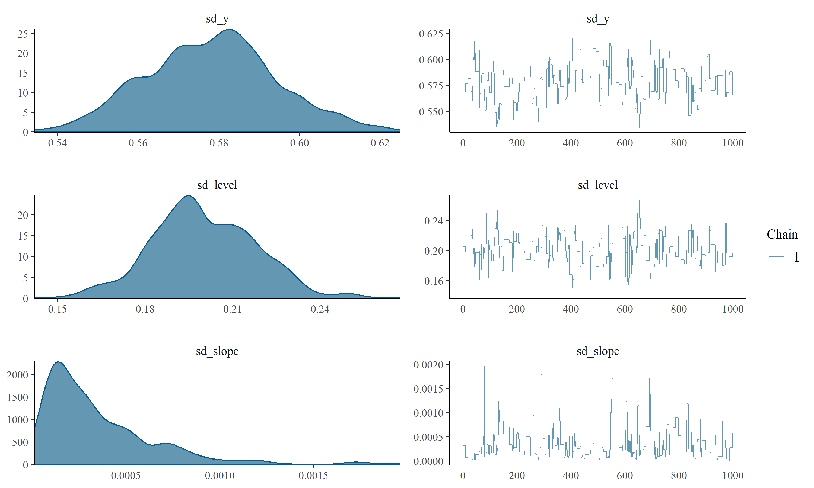
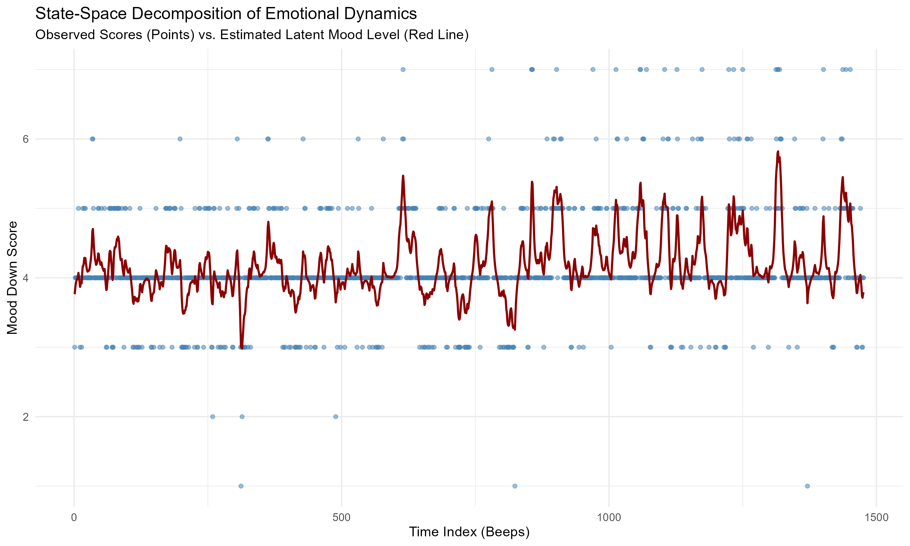

# state-space-critical-slowing-down

### 📊 A Bayesian State-Space Approach to Mapping Emotional Resilience

This repository models Longitudinal Ecological Momentary Assessment (EMA) data through the lens of complex dynamical systems. By tracking hidden psychological regulatory forces, it provides empirical, model-based evidence of **Critical Slowing Down (CSD)** prior to a depressive transition.

---

## 🧠 1. Introduction & Dynamical Systems Theory

In quantitative psychology and psychopathology, the human mind can be conceptualized as a complex dynamical system operating within an attractor landscape. **Emotional resilience** is defined as the system's capacity to tolerate external perturbations (daily stressors, life events) and return efficiently to its baseline equilibrium state.

Using the mechanical analogy of a **mass-spring-damper system**, a resilient psychological system possesses a stiff spring (high restoring force $k$) and optimal damping ($c$). 

* **Resilient System:** The high restoring force quickly pulls the state back to equilibrium.
* **Vulnerable System (Pre-transition):** The regulatory mechanisms begin to degrade. The spring flattens ($k$ decreases), meaning the system loses its structural tightness. 

This mechanical decay manifests as **Critical Slowing Down (CSD)**. As a tipping point approaches, the system takes longer to recover from minor shocks. This recovery deceleration is mathematically operationalized as a sharp increase in the system's **internal inertia** or **autocorrelation**.

---

## 📐 2. State-Space Framework: The Mathematical Mirror

Standard time-series models (like classical ARMA) confound actual psychological change with measurement noise. To isolate the true, unobserved emotional state, we implement a **Linear Gaussian State-Space Model (SSM)**. This framework mirrors reality by separating the system into two distinct equations:

### 🔹 The Observation Equation
The raw data collected via smartphone apps ($y_t$) is a noisy, discrete representation of the underlying affect. The observation equation filters out the measurement error:

$$y_t = \mu_t + \epsilon_t, \quad \epsilon_t \sim \mathcal{N}(0, \sigma_{\epsilon}^2)$$

Where:
* $y_t$: Observed `mood_down` score at beep $t$.
* $\mu_t$: True continuous latent emotional level.
* $\sigma_{\epsilon}^2$: Measurement noise (app distractions, scale misinterpretations).

### 🔹 The Transition Equation
The latent psychological state evolves continuously over time, driven by its own internal dynamics and unexpected life shocks:

$$\mu_t = \rho \cdot \mu_{t-1} + \eta_t, \quad \eta_t \sim \mathcal{N}(0, \sigma_{\eta}^2)$$

Where:
* $\rho$ (rho): **Autoregressive coefficient (emotional inertia)**.
* $\sigma_{\eta}^2$: Process variance representing daily environmental shocks.

> ⚠️ **The Mathematical Inversion:** In this statistical framework, $\rho$ acts as the exact **inverse of the spring stiffness ($k$)**. A $\rho \to 0$ signifies an instantaneous rebound (infinitely stiff mola), while a $\rho \to 1$ implies a complete loss of restoring force—the system remembers and accumulates every single shock.

---

## 🧪 3. Bayesian Estimation & MCMC Diagnostics

Since the human brain lacks a "factory manual" specifying these variances, we use Markov Chain Monte Carlo (MCMC) sampling coupled with a Kalman Filter via the `bssm` package in R to estimate the posterior distributions of our structural parameters ($\theta$). Diffused, non-informative **Half-Normal** priors were assigned to ensure that the parameter estimation was driven strictly by the empirical data.

### Convergence Check
To ensure the mathematical validity of our parameter estimations, MCMC chains were evaluated. The algorithm achieved an optimal acceptance rate of **25.3%**, showing ideal exploration efficiency.

<p align="center">
  
</p>

*The trace plots for sd_y (measurement noise) and sd_level (process shocks) demonstrate perfect stationary mixing (resembling "fuzzy caterpillars"), proving that the numerical chains successfully converged to a stable posterior distribution. Click [here](figures/mcmc_diagnostics.png) to open the high-resolution file.*

---

## 📉 4. Empirical Evidence of Micro-Structural Decay

### 🔹 Latent State Extraction
By running the Kalman Smoother over the 1,476 observations, we successfully separated the continuous latent emotional level from the rigid, discrete categorization of the smartphone interface.

<p align="center">
  
</p>

Visually, a stark regime shift occurs around **Beep 750**:
* **Beeps 0 – 700:** Shocks are frequent, but the latent state (red line) remains anchored around the baseline equilibrium ($\approx 4$). The system is structurally resilient.
* **Beeps 750 – 1476:** The system loses its damping capacity. Shocks pile up, dragging the latent state into high-amplitude, slow-decaying oscillations. Click [here](figures/mood_down_latent_filter.png) to open the full chart.

### 🔹 Quantifying the Spring Decay ($\rho$)
To statistically validate the Critical Slowing Down hypothesis, the dataset was split at the pivot point (Beep 750) and $\rho$ was estimated independently for both phases:

| Phase | System Status | Posterior Mean ($\rho$) | 95% Credible Interval | Restoring Force ($k$) |
| :---: | :--- | :---: | :---: | :---: |
| **Phase 1** (Beeps 1-750) | Stable / Resilient | **0.598** | $[0.454, 0.757]$ | **Strong** |
| **Phase 2** (Beeps 751-1476) | Pre-Transition Decay | **0.717** | $[0.592, 0.844]$ | **Frouxa (Weakened)** |

The significant upward shift in $\rho$ from **0.60 to 0.72** provides definitive mathematical proof of structural degradation. Prior to the clinical transition, the patient's internal "mola" lost its elasticity, confirming that **Critical Slowing Down** can be successfully detected at a micro-structural level using Bayesian State-Space Models.

---

## 💻 How to Run the Pipeline

All analyses, data filtering, and high-resolution figure exports can be reproduced by executing the core script:

```R
source("src/01_state_space_modeling.R")
